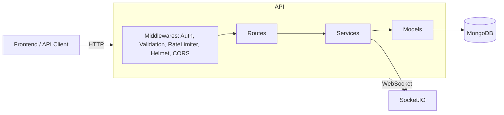
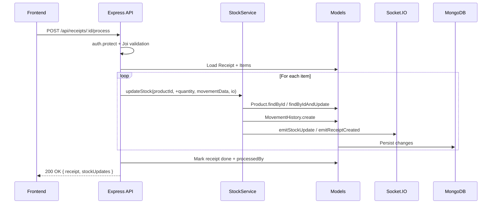

# StockMaster_Odoo Backend Architecture

A clear, visual overview of the backend design: layer boundaries, data flow, main components, and how requests move through the system.

## Tech Stack
- Runtime: `Node.js (>=18)`
- Framework: `Express`
- Database: `MongoDB` via `Mongoose`
- Auth: `JWT`
- Real‑time: `Socket.IO`
- Validation: `Joi`
- Security: `Helmet`, `CORS`, `Rate Limiting`
- Utilities: `Nodemailer` for email, seed script for demo data

## Folder Structure
```
backend/src/
├─ config/
│  └─ database.js                # Mongo connection & events
├─ middlewares/
│  ├─ auth.js                    # JWT protect
│  ├─ errorHandler.js            # Centralized error mapping
│  └─ validation.js              # Joi schemas (product, warehouse, docs)
├─ models/                        # Mongoose schemas
│  ├─ Product.js
│  ├─ Warehouse.js
│  ├─ Receipt.js
│  ├─ Delivery.js
│  ├─ Transfer.js
│  ├─ StockAdjustment.js
│  ├─ MovementHistory.js
│  └─ User.js
├─ routes/                        # Express routers (feature‑oriented)
│  ├─ productRoutes.js
│  ├─ warehouseRoutes.js
│  ├─ receiptRoutes.js
│  ├─ deliveryRoutes.js
│  ├─ transferRoutes.js
│  ├─ adjustmentRoutes.js
│  ├─ historyRoutes.js
│  ├─ dashboardRoutes.js
│  └─ authRoutes.js
├─ services/
│  └─ stockService.js            # Stock updates + Movement logging + Alerts
├─ utils/
│  ├─ socketEvents.js            # Socket event helpers
│  ├─ sendEmail.js               # Email utility (OTP, notifications)
│  ├─ generateToken.js           # JWT creation
│  └─ seedData.js                # Demo data seeding
└─ server.js                      # App bootstrap, middleware, sockets
```

## Runtime Architecture


## Request Lifecycle (HTTP)
1. Client calls REST endpoint (e.g., `POST /api/receipts/:id/process`).
2. Global middlewares run:
   - `helmet`, `cors`, `express.json/urlencoded`, `rate-limit`.
3. Route‑specific middlewares:
   - `auth.protect` verifies `JWT`.
   - `validation` ensures payload shape via `Joi`.
4. Controller logic in `routes/*` reads/writes models.
5. Business logic in `services/` encapsulates cross‑feature actions (e.g., `StockService.updateStock`).
6. Persist via `models/*` (Mongoose).
7. Emit realtime events via `utils/socketEvents` and `socket.io` when needed.
8. Centralized error handling maps known errors to clean HTTP responses.

## Key Components

### Models
- `Product`: core item attributes; indexes for `sku`, `category`, `warehouse`, text search on `name/sku`; virtual `stockStatus`.
- `Warehouse`: physical locations for inventory.
- `Receipt`: incoming stock; pre‑save reference `RCP-xxxx` and total calculation.
- `Delivery`: outgoing stock; pre‑save reference `DEL-xxxx` and total calculation.
- `Transfer`: internal movement between warehouses; pre‑save reference `TRF-xxxx`.
- `StockAdjustment`: audit corrections; pre‑save computes item differences and total adjustment.
- `MovementHistory`: immutable ledger of movements, linked to product and source docs.
- `User`: actors performing operations; used in auth and attribution.

### Services
- `StockService.updateStock(productId, quantity, movementData, io)`
  - Validates current stock constraints (no negative on outgoing).
  - Updates product’s `currentStock`.
  - Creates `MovementHistory` record.
  - Emits realtime updates: `stock:update` and `stock:low_alert` when thresholds hit.
- Bulk operations and dashboards (`getStockLevels`, `getLowStockProducts`, `getOutOfStockProducts`).

### Routes
- Feature‑oriented routers:
  - `products`, `warehouses`, `receipts`, `deliveries`, `transfers`, `adjustments`, `history`, `dashboard`, `auth`.
- Controllers orchestrate validation → service calls → model persistence → websocket emits.

### Real‑Time (Socket.IO)
Events emitted for live dashboards and notifications:
- `stock:update`, `stock:low_alert`
- `receipt:created`, `delivery:created`, `transfer:created`, `adjustment:created`
- `product:*`, `warehouse:*`
- Per‑user channel helper: `io.to("user_<id>")` via `emitToUser`

## Validation & Error Handling
- Validation: `middlewares/validation.js` with `Joi` schemas for create/update on entities.
- Error Handling: `middlewares/errorHandler.js` maps common cases:
  - Bad ObjectId, duplicate keys, validation errors, JWT errors.

## Security
- `helmet` secure headers; `cors` configured.
- `express-rate-limit` to mitigate abuse.
- `JWT` authentication in `auth.js`.
- Sensitive fields excluded from logs; avoid logging secrets.

## Configuration
- Environment via `.env`:
  - `MONGO_URI`, `JWT_SECRET`, `JWT_EXPIRE`, `NODE_ENV`
  - Email: `EMAIL_HOST`, `EMAIL_PORT`, `EMAIL_USER`, `EMAIL_PASS`, `EMAIL_FROM`
- `config/database.js` establishes and monitors DB connection, with reconnect handlers.

## Development & Seeding
- Install & run:
  - `cd backend && npm install && npm run dev`
- Seed demo data:
  - `node src/utils/seedData.js` (runs when called directly)
  - Creates users, warehouses, products, receipts, deliveries; prints sample credentials.

## Deployment Notes
- Ensure environment variables set and secrets managed securely.
- Enable sticky sessions or a Socket.IO adapter (e.g., Redis) if horizontally scaling.
- Health checks: expose a simple route or rely on DB connection events.

## Observability
- Prefer structured logs; avoid sensitive data.
- Add metrics around movement processing and stock update latency if needed.

## Extension Points
- New feature flow:
  1. Define Mongoose model (if needed).
  2. Add `Joi` validation in `middlewares/validation.js`.
  3. Create route/controller in `routes/`.
  4. Encapsulate business logic in `services/`.
  5. Emit any Socket.IO events via `utils/socketEvents.js`.
  6. Add indexes for query performance.

## Example Sequence: Process Receipt


## API Surface (High‑Level)
- `GET/POST /api/products` CRUD & search
- `GET/POST /api/warehouses` CRUD
- `POST /api/receipts/:id/process` receipt handling
- `POST /api/deliveries/:id/process` delivery handling
- `POST /api/transfers/:id/process` internal moves
- `POST /api/adjustments/:id/process` stock audit corrections
- `GET /api/history` movement ledger, stats, product history
- `POST /api/auth/*` login/register/verify

---
This document serves as the single source of truth for how the backend is structured and how features integrate across routes, services, models, and realtime events.